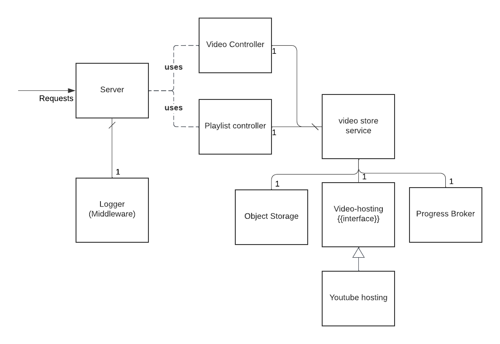

# Video store

An API for storing/retrieving videos from "any generic" video storage platform.

Although the only targeted platform is Youtube for the time being, the point of the generic approach
is to be able to change easily if needed be.

The full API documentation is available [here](https://sotrxii.github.io/video-store/) 

## Architecture 

This project architecture is pretty simple :
- A server uses two controller, processing the request 
- Correct requests are then handled by a single service *Video Store Service*
- This service uses 3 dependencies :
  - Object storage : Store && retrieve from a remote S3-like storage solution
  - Progress broker : Publish to a remote broker 
  - One of the platform specific hosting API. Any platform could be added, granted they extend the *IVideoHost* interface

## Features

- Excute CRUD operation on the "generic platform" videos and playlist
- Upload a new video on this "generic platform". The video has to be upload from an object storage solution

## Configuration

Here is the full list of all available env variables:
+ Youtube-related: Youtube Data API v3 env. These variables are theorically optionals, but as Youtube is the only store supported at the moment, they are **required**. See [configuring Youtube](#configuring-youtube) to know how to retrieve them
  + **YT_CLIENT_ID**
  + **YT_CLIENT_SECRET** 
  + **YT_REFRESH_TOKEN** 
+ [Dapr](https://dapr.io/)-related: 
  + **OBJECT_STORE_NAME** (required) : Name of the Dapr component pointing to the backend storage solution
  + **PUBSUB_NAME** (optional) : Name of the Dapr component pointing to an event broker. This is optional, no events are emitted if this variable isn't filled.
  + **PUBSUB_TOPIC_PROGRESS** (optional) : Topic to publish event into. Default is *upload-state*
  + **DAPR_GRPC_PORT** (optional) : GRPC port to connect to the sidecar. Default is *50001*
+ Misc
  + **GIN_MODE** (optional) : [Gin framework](https://github.com/gin-gonic/gin) verbose status. Either "debug" or "release". Default is *debug*
  + **APP_PORT** (optional) : App listening port. Default is *8080*

## Platforms

### Configuring Youtube

Google's Oauth is a bit of a pain to work with. 
To be able to upload videos, we have to include the scope *https://www.googleapis.com/auth/youtube.upload*.

However, this scope requires a three-legged oauth validation, and there is no real way to use a Service Account
for this specific API.

So, to make this work :
1. Go to the [Google API dashboard](https://console.cloud.google.com/apis/dashboard) and create a project
2. In the project dashboard, in **Credentials** create a new **Web application** client id/client secret pair
3. Next, go to [Google's oauth playground website](https://developers.google.com/oauthplayground/), click on the cogwheel icon and input your clientID/client secret
4. In scopes, select *https://www.googleapis.com/auth/youtube*, *https://www.googleapis.com/auth/youtube* and click on "Authorize APIs"
5. You'll get an authorization code, click on "Exchange for token" to get an access token and a refresh token. 

With this, we have all the values for the env variables needed for authenticating to Youtube :

- YT_CLIENT_ID
- YT_CLIENT_SECRET
- YT_REFRESH_TOKEN

The access token will be (re)generated from the refresh token automatically.